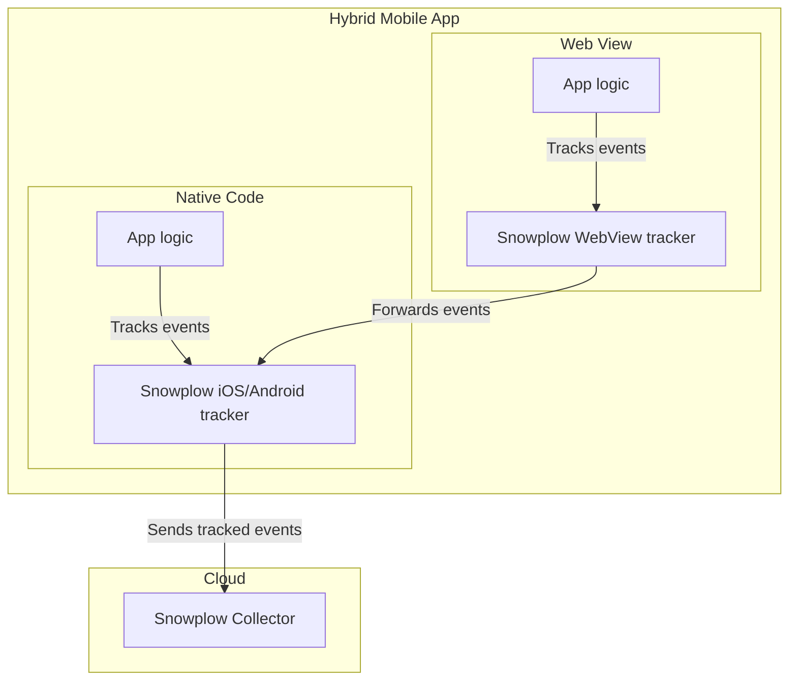

# Snowplow WebView Tracker

[![early-release]][tracker-classificiation]
[![Build Status][gh-actions-image]][gh-actions]
[![Release][release-image]][releases]
[![License][license-image]][license]

Snowplow is a scalable open-source platform for rich, high quality, low-latency data collection. It is designed to collect high quality, complete behavioral data for enterprise business.

**To find out more, please check out the [Snowplow website][website] and our [documentation][docs].**

## Snowplow WebView Tracker Overview

The Snowplow WebView Tracker allows you to add analytics to your Web views embedded in mobile apps when using a [Snowplow][snowplow] pipeline.

The WebView tracker should be integrated in Web apps used in Web views within native mobile apps. The tracker provides APIs to track Snowplow events. It forwards the events to the native app code to be tracked by the Snowplow mobile trackers ([iOS](https://github.com/snowplow/snowplow-objc-tracker) or [Android tracker](https://github.com/snowplow/snowplow-android-tracker)). The diagram below shows the interaction of the WebView and iOS/Android trackers in hybrid apps.



**Technical documentation can be found for each tracker in our [Hybrid Apps accelerator][webview-docs].**

## Quick Start

### Installation from npm

To install the WebView tracker in your JavaScript or TypeScript app, add the npm package:

```bash
npm install --save @snowplow/webview-tracker
```

You will then be able to use the functions provided by the WebView tracker as follows:

```typescript
import { trackSelfDescribingEvent } from '@snowplow/webview-tracker';
```

In addition, you will need to install the iOS or Android tracker in your native code and configure and initialize a tracker (see the [mobile tracker docs][mobile-tracker-setup-docs]). Afterwards, you will be able to subscribe to and track the events from the WebView tracker in a Web view by calling `Snowplow.subscribeToWebViewEvents(webView)`.

### Installation with the Snowplow tag

You may download the `sp.js` file from the Releases section Github, self-host it, and load to your page using the following tag:

```html
<script type="text/javascript" async=1>
;(function(p,l,o,w,i,n,g){if(!p[i]){p.GlobalSnowplowNamespace=p.GlobalSnowplowNamespace||[]; p.GlobalSnowplowNamespace.push(i);p[i]=function(){(p[i].q=p[i].q||[]).push(arguments) };p[i].q=p[i].q||[];n=l.createElement(o);g=l.getElementsByTagName(o)[0];n.async=1; n.src=w;g.parentNode.insertBefore(n,g)}}(window,document,"script","{{URL to sp.js}}","snowplow"));
</script>
```

### Using the Tracker

To track events, simply call their corresponding functions given the event data:

```javascript
trackSelfDescribingEvent({
    event: {
        schema: 'iglu:com.example_company/save_game/jsonschema/1-0-2',
        data: {
            'saveId': '4321',
            'level': 23,
            'difficultyLevel': 'HARD',
            'dlContent': true
        }
    }
});
```

In case you loaded the tracker using the Snowplow tag, you will be able to access the APIs using `window.snowplow`:

```javascript
window.snowplow('trackSelfDescribingEvent', {
    event: {
        schema: 'iglu:com.example_company/save_game/jsonschema/1-0-2',
        data: {
            'saveId': '4321',
            'level': 23,
            'difficultyLevel': 'HARD',
            'dlContent': true
        }
    }
});
```

See the [section on event tracking in the accelerator][webview-docs-tracking-events] to learn more about the APIs.

## Find Out More

| Accelerator                           |
|---------------------------------------|
| [![i1][techdocs-image]][webview-docs] |
| [Accelerator][webview-docs]           |

## Maintainers

| Contributing                                 |
|----------------------------------------------|
| [![i4][contributing-image]](CONTRIBUTING.md) |
| [Contributing](CONTRIBUTING.md)              |

## Copyright and License

The Snowplow WebView Tracker is copyright 2022 Snowplow Analytics Ltd.

Licensed under the **[Apache License, Version 2.0][license]** (the "License");
you may not use this software except in compliance with the License.

Unless required by applicable law or agreed to in writing, software
distributed under the License is distributed on an "AS IS" BASIS,
WITHOUT WARRANTIES OR CONDITIONS OF ANY KIND, either express or implied.
See the License for the specific language governing permissions and
limitations under the License.

[website]: https://snowplowanalytics.com
[snowplow]: https://github.com/snowplow/snowplow
[docs]: https://docs.snowplowanalytics.com/
[webview-docs]: https://snowplow-incubator.github.io/snowplow-hybrid-apps-accelerator/
[webview-docs-tracking-events]: https://snowplow-incubator.github.io/snowplow-hybrid-apps-accelerator/tracking/3-webview_usage/
[mobile-tracker-setup-docs]: https://docs.snowplowanalytics.com/docs/collecting-data/collecting-from-own-applications/mobile-trackers/mobile-trackers-v3-0/quick-start-guide/

[gh-actions]: https://github.com/snowplow-incubator/snowplow-webview-tracker/actions/workflows/build.yml
[gh-actions-image]: https://github.com/snowplow-incubator/snowplow-webview-tracker/actions/workflows/build.yml/badge.svg

[license]: https://www.apache.org/licenses/LICENSE-2.0
[license-image]: https://img.shields.io/badge/license-Apache--2-blue.svg?style=flat

[release-image]: https://img.shields.io/npm/v/@snowplow/webview-tracker
[releases]: https://github.com/snowplow-incubator/snowplow-webview-tracker/releases

[techdocs-image]: https://d3i6fms1cm1j0i.cloudfront.net/github/images/techdocs.png

[contributing-image]: https://d3i6fms1cm1j0i.cloudfront.net/github/images/contributing.png

[tracker-classificiation]: https://github.com/snowplow/snowplow/wiki/Tracker-Maintenance-Classification
[early-release]: https://img.shields.io/static/v1?style=flat&label=Snowplow&message=Early%20Release&color=014477&labelColor=9ba0aa&logo=data:image/png;base64,iVBORw0KGgoAAAANSUhEUgAAABAAAAAQCAMAAAAoLQ9TAAAAeFBMVEVMaXGXANeYANeXANZbAJmXANeUANSQAM+XANeMAMpaAJhZAJeZANiXANaXANaOAM2WANVnAKWXANZ9ALtmAKVaAJmXANZaAJlXAJZdAJxaAJlZAJdbAJlbAJmQAM+UANKZANhhAJ+EAL+BAL9oAKZnAKVjAKF1ALNBd8J1AAAAKHRSTlMAa1hWXyteBTQJIEwRgUh2JjJon21wcBgNfmc+JlOBQjwezWF2l5dXzkW3/wAAAHpJREFUeNokhQOCA1EAxTL85hi7dXv/E5YPCYBq5DeN4pcqV1XbtW/xTVMIMAZE0cBHEaZhBmIQwCFofeprPUHqjmD/+7peztd62dWQRkvrQayXkn01f/gWp2CrxfjY7rcZ5V7DEMDQgmEozFpZqLUYDsNwOqbnMLwPAJEwCopZxKttAAAAAElFTkSuQmCC
